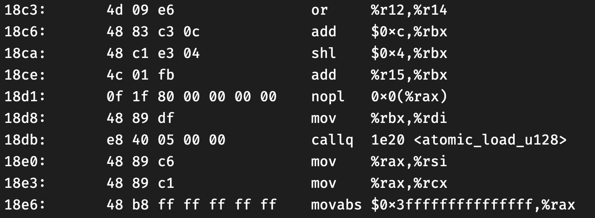

# Table of Contents

1.  [DEBUGGING](#org923bc0d)
    1.  [Be aware of non-volatile registers](#orgafaefce)
    2.  [Blame yourself before blaming your compiler](#org0db106e)
        1.  [suggestions](#org1608486)
    3.  [setc, sete, setz, setb等](#org0e133b3)
    4.  [use gcc/clang extended assembly](#orgbd436d0)

[Back to index](./index.html)

最近在写一个用户态抢占式调度线程。这次想写细致和全面一些（基准性能 && 支持异步IO）。一些原子操作我选择汇编实现，踩了一些坑，花了很长时间才定位到问题出在汇编代码上。

# DEBUGGING

当你遇到以下类似的BUG时，你很可能需要检查一下自己的汇编代码是否出错。

## Be aware of non-volatile registers

根据System V AMD64 ABI, `%rbp`, `%rsp`, `%rbp`, `%rbx`, `%r12`, `%r13`, `%r14`, `%15` 是non-volatile registers(callee-saved)。 caller从called function中返回后，认为这些寄存器的值是不变的。 如果callee有涉及修改这些寄存器的操作，则它负责在函数开始/返回前保存和恢复这些寄存器的值。

有时候，所写的汇编函数很短，不涉及栈上操作，很容易忽视以上规则。如以下函数：

    // proto: u128 atomic_load_u128(u128* addr)
    atomic_load_u128:
      movq %rax, %rbx
      movq %rdx, %rcx
      LOCK
      cmpxchg16b (%rdi)
      retq

该函数原子地读取addr地址处的128bit(16B)数据。 `cmpxchg16b` 将 `(addr)` 和 `rdx:rax` 比较，若相等，将 `rcx:rbx` 存到 `(addr)` 处；否则，将 `(addr)` load到 `rdx:rax` 中。 因此，令 `rcx:rbx` 等于 `rdx:rax` ， `rdx:rax` 中肯定是 `(addr)` 处的值。

这个函数错在 `movq %rax, %rbx` 修改了 `%rbx` 的值，而该函数并没有保存和恢复 `%rbx` 的原始值。

在如下这段程序中，caller使用了 `%rbx` ，而atomicloadu128改变了它，导致程序出错。

另外，这是我之前的另一个函数，存在相同问题：

    // int atomic_cas_u128(u128* addr, u128 old, u128 new)
    atomic_cas_u128:
      movq %rsi, %rax
      movq %rcx, %rbx
      movq %r8, %rcx
      LOCK
      cmpxchg16b (%rdi)
      sete %al
      retq

因此出现了如下错误：

图中， `scq_push(scq_t *q, u64 val)` 传入的q是一个有效的指针，且scq_push没有对q做过任何修改，在执行到149行后，q变为了0x0，像幻觉一样。这是因为在 `movq %rcx, %rbx` 时，修改了 `rbx` ，而 `rcx` 存的是 `new.data=val=0` ，因此，在返回后，q变为了0。

修改后的正确函数如下：

    atomic_load_u128:
      movq %rbx, %rax
      movq %rcx, %rdx
      LOCK
      cmpxchg16b (%rdi)
      retq
    
    atomic_cas_u128:
      pushq   %rbx
      movq    %rcx, %rbx
      movq    %rsi, %rax
      xorl    %esi, %esi
      movq    %r8, %rcx
      lock
      cmpxchg16b      (%rdi)
      sete    %sil
      movl    %esi, %eax
      popq    %rbx
      retq

对于第一个函数，我们把 `%rbx` mov到 `%rax` ，就不需要保存 `rbx` 了。

对于第二个函数， `%rbx` 是一定会被修改的，我们需要在开始时将其保存到栈上，返回前再恢复。

总结一下，这种missing会导致很多奇怪的错误。上面的例子只是其中一种。如果被修改的寄存器存的是某个变量的地址，在后续访问该变量时，程序可能会抛出SIGSEGV。如果存的是某个变量的值，那程序甚至不会抛出任何异常，只是你的代码的行为变为unexpected了。例如，如果上面 `rbx` 存的是val的值，那我可能一个月后也不会发现问题，因为仅仅是我的存入 `q->entries[j]` 的val是错误的。

## Blame yourself before blaming your compiler

如果你没有在写操作栈帧的代码（如buffer overflow），或者直接操作指令寄存器的代码（如JIT），大量硬件层面的汇编代码、大量操作向量寄存器的代码等，那请相信你的编译器。

很多时候，我们的代码在Debug模式（-O0）下运行“没有问题”（指没有报错，测试case通过），自信满满地开启Release模式（-O2或-O3）后，各种segmentation fault，freeing twice的错误、各种deadlock铺天盖地地袭来，然后开始责怪编译器做了奇怪甚至错误的激进优化。

忘了在哪看到过一句话：

> When a bug goes away by disabling optimizations, most of the time, it's still your fault.

拿上面的例子来说吧，原先的代码最初在关闭优化的情况下，我也没看到有异常抛出。这是为什么，明明rbx的值被修改了？

我们找个简单的函数看一下-O0和-O3下生成的汇编代码的区别：

    int add(int a, int b){
      int c = a+b;
      int d = a-b;
      int e = d;
      int f = do_nothing(c, d, e, a);
      return a;
    }

    // -O0
    add:
          pushq   %rbp
          movq    %rsp, %rbp
          subq    $32, %rsp
          movl    %edi, -20(%rbp)
          movl    %esi, -24(%rbp)
          movl    -20(%rbp), %edx
          movl    -24(%rbp), %eax
          addl    %edx, %eax
          movl    %eax, -4(%rbp)
          movl    -20(%rbp), %eax
          subl    -24(%rbp), %eax
          movl    %eax, -8(%rbp)
          movl    -8(%rbp), %eax
          movl    %eax, -12(%rbp)
          movl    -20(%rbp), %ecx
          movl    -12(%rbp), %edx
          movl    -8(%rbp), %esi
          movl    -4(%rbp), %eax
          movl    %eax, %edi
          call    do_nothing
          movl    %eax, -16(%rbp)
          movl    -20(%rbp), %eax
          leave
          ret
    
    // -O3
    add:
          pushq   %rbx
          movl    %edi, %eax
          movl    %edi, %ebx
          leal    (%rdi,%rsi), %edi
          subl    %esi, %eax
          movl    %ebx, %ecx
          movl    %eax, %edx
          movl    %eax, %esi
          call    do_nothing
          movl    %ebx, %eax
          popq    %rbx
          ret

可以看到，在-O0时，编译器主要在栈上分配局部变量。在-O3时，编译器会尽量使用寄存器存储局部变量。因此，在之前错误的代码中， `%rbx` 没有被caller用到，自然被callee修改也没有影响。

### suggestions

除了上述例子，一个在并发场景下经常会遇到的问题就是指令重排（re-ordering）。

说一个我以前的经历，调试一个文件系统，Debug模式下正常，切到-g -O2下不正常，一个我认为值应该改变了的变量，却没有变。加上printf打印该变量，又正常了。 删掉printf，用gdb打断点，也是正常的。

最后发现其实在开启优化的条件下，编译器会将一些读写指令重排，如果你写的是多线程程序，这很可能导致你的程序运行进入一个不一致的状态。这要求你手动插入一些读写屏障（或内存栅栏），这个问题很复杂，涉及到内存模型、缓存一致性等内容，不同cpu指令集的内存模型的强弱是不一样的。

基于指令集提供的保障内存序的指令，可以实现基本的原子操作，进而实现锁、信号量等各种同步原语。从内存屏障->原子操作->锁，同步的范围变大，但性能也越变越差。

printf打印变量可能改变了生成的代码，gdb打断点可能会插入内存屏障，造成行为不一样，难以调试。

但这不是编译器的BUG，而是程序的并发逻辑错误或者没有正确地同步共享变量。

你可以选择使用内存屏障(如mfence，std::memory_order)、原子操作(如gcc内置的__sync__)、锁（如spinlock，linux futex）等来同步你的线程对于共享变量的访问。 从左到右序依次增强、同步逻辑依次简化，但开销也依次增大。

## setc, sete, setz, setb等

这几个指令会的目的寄存器是单字节的，如 `%al`, `%dil`, `%cl` ， 它们分别代表 `%rax` , `%rdi`, `%rcx` 的最低8位。

如 `setz %al` 会根据状态寄存器的ZF标志位，将 `%al` 置1或置0。

**但它不会影响rax的其它位**

    // int atomic_bts_u64(u64* addr, u64 shift)
    atomic_bts_u64:
      LOCK
      btsq %rsi, (%rdi)
      setc %al
      retq

上面的代码的意图是将(addr)的第shift位置1，并返回该位原先的值。

但如果在调用前 `%eax` （int是低32位）的高24位非0，那返回值无论如何都大于0，直接拿它去做条件判断，都是true。

因此在使用前应该将其置0

    atomic_bts_u64:
      xorl %eax, %eax
      LOCK
      btsq %rsi, (%rdi)
      setc %al
      retq

置0的方法有多种，很多编译器选择xorl，因为对于源寄存器和目的寄存器相同的xorl，cpu有特殊优化。

尽量不要在btsq/cmpxchg等指令之后才清零，因为这有可能改变状态寄存器的flag。

但如果 `%rax` 被cmpxchg16这样的指令用到了，我们没法提前置0呢？那就需要再用一个临时的寄存器了，如：

    // version 1
    atomic_cas_u128:
      pushq   %rbx
      movq    %rcx, %rbx
      movq    %rsi, %rax
      xorl    %esi, %esi  // zero
      movq    %r8, %rcx
      lock
      cmpxchg16b      (%rdi)
      sete    %sil
      movl    %esi, %eax
      popq    %rbx
      retq
    
    // version2
    atomic_cas_u128:
      pushq   %rbx
      movq    %rcx, %rbx
      movq    %rsi, %rax
      movq    %r8, %rcx
      lock
      cmpxchg16b      (%rdi)
      sete    %sil
      movzbl  %sil, %eax // zero and move
      popq    %rbx
      retq

version2的movzbl在mov前会将 `%eax` 置0。

## use gcc/clang extended assembly

纯手写的汇编没有给编译器留下优化的空间，还有可能存在潜在bug（如不遵守calling convention），如果可以，尽量使用gcc/clang的内联汇编。

<https://gcc.gnu.org/onlinedocs/gcc/Extended-Asm.html>

不过还是有一些细节需要留意。

看一个case:

    typedef struct {
        unsigned long flag;
        unsigned long data;
    } u128;
    
    int atomic_cas_u128(u128 *addr, u128 old, u128 new){
        int ret = 0;
        asm (
    	"LOCK\n\t"
    	"cmpxchg16b %1\n\t"
    	"sete %b0\n"
    	:"+r"(ret), "+m"(*addr)
    	:"d"(old.data), "a"(old.flag), "c"(new.data), "b"(new.flag)
    	:"memory"
        );
        return ret;
    }

比较关键的有两点：

1.  初始化ret=0 以及 `"+r"(ret)` 中的＋是必须的。 这告诉编译器，ret是作为值为0的变量输入到asm块中的，因此在 `sete %b0` 时，会意识到应该先将临时保存ret的寄存器清0。
2.  `sete %b0` 的b代表使用寄存器的低8位。在gcc上，不加b可以生成汇编代码，但在生成.o二进制文件时会报错，因为sete的操作寄存器应该是8位的。 在clang上会显式报错。

clang15 -O3生成的汇编：

    atomic_cas_u128:                        # @atomic_cas_u128
          pushq   %rbx
          movq    %rcx, %rbx
          movq    %rsi, %rax
          xorl    %esi, %esi
          movq    %r8, %rcx
          lock
          cmpxchg16b      (%rdi)
          sete    %sil
    
          movl    %esi, %eax
          popq    %rbx
          retq

可以看到只要写对了输入、输出变量和正确的约束，编译器会帮我们处理好calling convention，在sete前清零寄存器等。

可以在此对比：<https://godbolt.org/z/beK7raooq>

