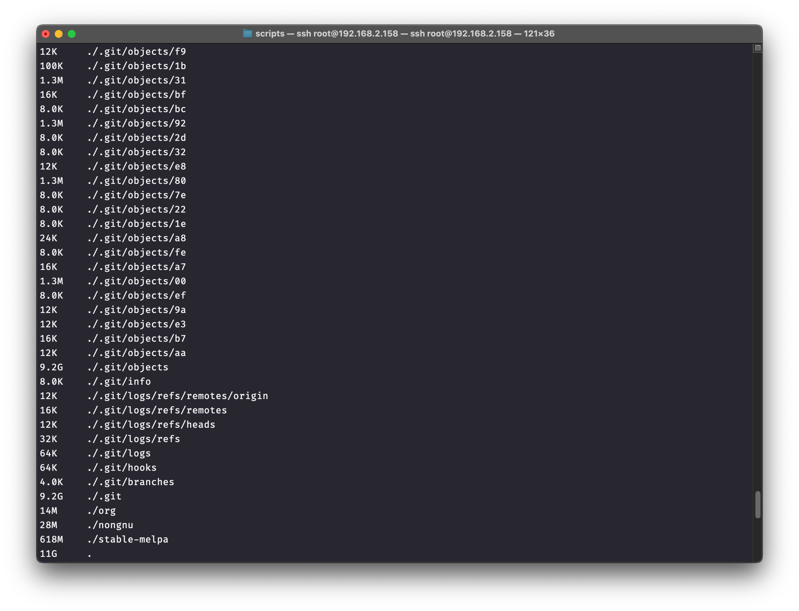
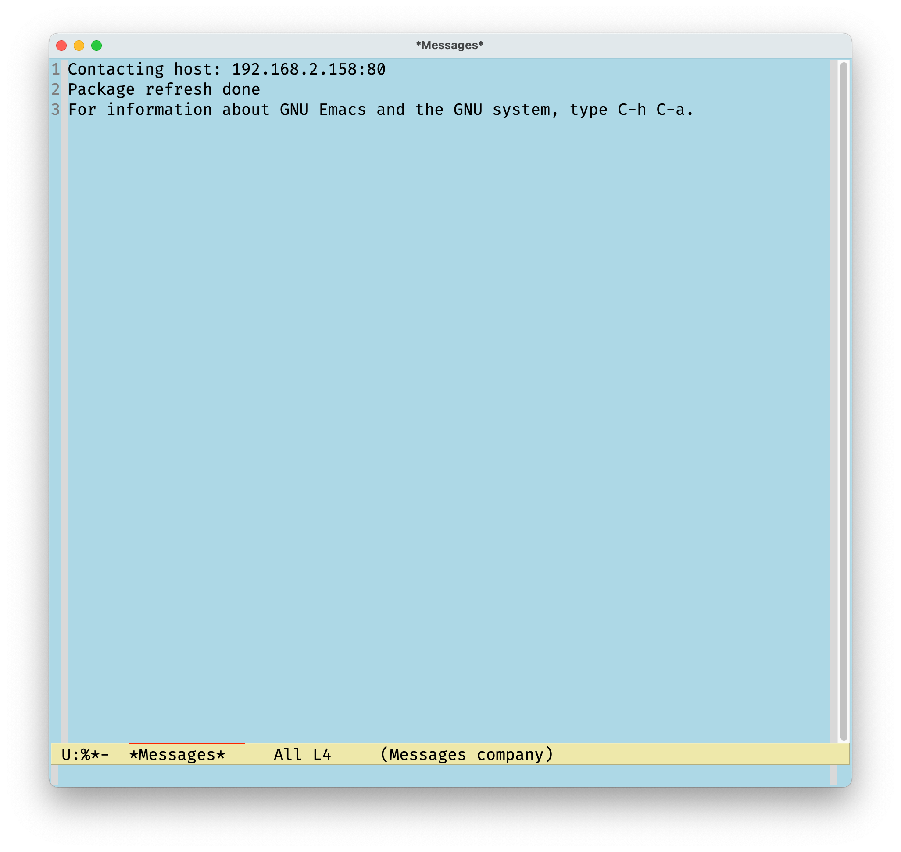

# Table of Contents

1.  [Local elpa mirror](#orgdea78fb)
    1.  [Use rsync](#org4b0c171)
        1.  [Install](#org5be7746)
        2.  [Usage](#orgf98dc19)
    2.  [Thin](#orgf531482)
    3.  [Configuration](#orgd31cdaf)
        1.  [use natively](#org7be7f71)
        2.  [use as a local http server](#orgba15b43)
        3.  [Effect](#orgce415d7)

[Back to index](../index.html)

# Local elpa mirror

Compared with pip or deb repo, elpa is really a smaller one (~ 1GB). You can sync GNU-ELPA or MELPA archives down to the local to replace the package-archives in the `~/.emacs.d/init.el`

## Use rsync

Rsync is a powerful command line tool to synchronize local files with files on the remote server (or local with local)

### Install

On Debian/Ubuntu:

    sudo apt-get install rsync

On Fedora/CentOS:

    yum install rsync

### Usage

There is rich functions with rsync, for this article, we only use:

    rsync -a <rsync-server-addr> <mapping-directory>

<table border="2" cellspacing="0" cellpadding="6" rules="groups" frame="hsides">

<colgroup>
<col  class="org-left" />

<col  class="org-left" />
</colgroup>
<thead>
<tr>
<th scope="col" class="org-left">Archives</th>
<th scope="col" class="org-left">Rsync server</th>
</tr>
</thead>

<tbody>
<tr>
<td class="org-left">GNU ELPA</td>
<td class="org-left">rsync://elpa.gnu.org/elpa/</td>
</tr>

<tr>
<td class="org-left">MELPA</td>
<td class="org-left">rsync://melpa.org/packages/</td>
</tr>

<tr>
<td class="org-left">TUNA</td>
<td class="org-left">rsync://mirrors.tuna.tsinghua.edu.cn/elpa/</td>
</tr>
</tbody>
</table>

The shell will be blocked and the synchronization has started, wait patiently until the sync finished. You can see in the router, rsync is downloading files from the server:

## Thin

You may find the size of the mapping folder much bigger than 1GB:

This is because rsync download this `.git` at the same time.

You can do this to thin the folder:

    cd <mapping-directory>
    git gc --prune=now

after thinning:

Or, you can simply delete `.git` or exclude `.git` folder when rsyncing:

    rsync -a --exclude=".git" <rsync-server-addr> <mapping-directory>

## Configuration

### use natively

If you use Emacs on the same machine as the <mapping-directory> is stored, you can setup like this:

    (setq package-archives '(("gnu"   . "<mapping-directory>/gnu/")
    			 ("org"   . "<mapping-directory>/org/")
    			 ("melpa" . "<mapping-directory>/melpa/")))

### use as a local http server

For example, you have more than one devices using Emacs in the LAN, configure the storing device to be a server.

Here I use Nginx to setup my Ras-Pi to be a server:

`/etc/nginx/sites-enabled/elpa.conf`

    server {
        listen                  80;
        listen                  [::]:80;
        server_name             _;
        root                    /mnt/samsung/mirror/elpa;  # replace with you <mapping-directory>
    
        # index.html fallback
        location / {
    	try_files $uri $uri/ /index.html;
        }
    }

Check the LAN address of Ras-Pi (192.168.2.158 here), edit `~/.emacs.d/init.el` of every device that will use the local mirror:

    (setq package-archives '(("gnu"   . "http://192.168.2.158/gnu/")
    			 ("org"   . "http://192.168.2.158/org/")
    			 ("melpa" . "http://192.168.2.158/melpa/")))

### Effect

You can write a shell that periodically rsync from server.

